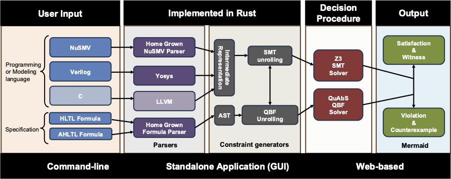

Introduction
============

**HyperQB** is a *push-button*, **bounded model checker** for verifying **hyperproperties**.
Hyperproperties [1] are systems-wide properties that express the behavior of system as a whole rather than the behavior of individual execution traces.
Hyperproperties can express important information-flow security policies (e.g., confidentiality and integrity), consistency models in concurrent computing (e.g., linearizability [2]]), robustness conditions in cyber-physical
systems [3], and path planning in multi-agent systems.
The core technology of HyperQB as a bounded model checker is based on an efficient transformation of the verification problem to solving the satisfiability problem for qunatified boolean formulas (QBF) and modulo theory (SMT).

Overview
--------
HyperQB can build and analyze several types of input models and temporal-logic specifications for hyperproperties.
The QBF/SMT-based technique allows HyperQB to seamlessly deal with quantifier alternations.
Based on the selection of either bug hunting or synthesis, the instances of counterexamples (for negated formula) or witnesses (for synthesis of positive formulas) are returned.

- **Inputs**:
    - A set of models (up to one per trace quantifier) in **NuSMV** or **Verilog** languages (the C -> LLVM path is still under construction) 
    - A **HyperLTL**[4] or **A-HLTL**[5] formula specifying the hyperproperty
    - The type of bounded semantics [6]
    - The type of loop condition
    - SMT or QBF decision procedure

- **Outputs**:
    - Dissatisfaction and *Counterexample*
    - Satisfaction and *Witness*

- **Core Technique**:
    1. Parse the inputs into Boolean/unrolled representations.
    2. Encode model plus temporal formula up to bound *k* as a **QBF** or **SMT** instance.
    3. Solve the QBF/SMT with a solver (currently **QuAbs/Z3**), then decode result back into:
        - A **counterexample** (bug hunting), or
        - A **witness** (trace set satisfying the property)

Sponsors
--------

[1] M. R. Clarkson and F. B. Schneider: **Hyperproperties.** Journal of Computer Security 18(6): 1157-1210 (2010)

[2] M. Herlihy and J. M. Wing. Linearizability: A correctness condition for concurrent objects. ACM Transactions on Programming Languages and Systems, 12(3):463–492 (1990)

[3] Y. Wang, M. Zarei, B. Bonakdarpour, Miroslav Pajic: Statistical Verification of Hyperproperties for Cyber-Physical Systems. ACM Transactions on Embedded Computing Systems 18(5s): 92:1-92:23 (2019)

[4] M. R. Clarkson, B. Finkbeiner, M. Koleini, K. K. Micinski, M. N. Rabe, C. Sánchez: Temporal Logics for Hyperproperties. POST 2014: 265-284

[5] J. Baumeister, N. Coenen, B. Bonakdarpour, B. Finkbeiner, C. Sánchez: A Temporal Logic for Asynchronous Hyperproperties. CAV (1) 2021: 694-717

[6] T.-H. Hsu, C. Sánchez, B. Bonakdarpour: Bounded Model Checking for Hyperproperties. TACAS (1) 2021: 94-112
