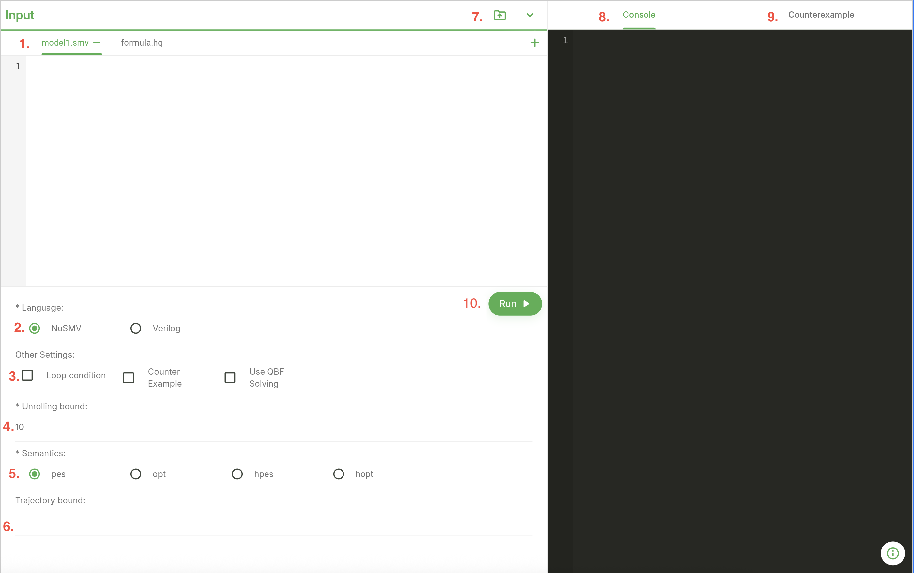

HyperQB Manual
===================
HyperQB is a push-button, bounded model checker for verifying hyperproperties. Hyperproperties are systems-wide properties that express the behavior of system as a whole rather than the behavior of individual execution traces.

Installation
---------------

MacOS Binary installation
^^^^^^^^^^^^^^^^^^^^^^
.. TODO

Source code installation
^^^^^^^^^^^^^^^^^^^^^^
.. TODO

Modeling Languages
--------------------

HyperQB currently accepts input models in two languages:

   - **NuSMV** is a symbolic BBD-based model checker originated in CMU. The full documentation of the input language is available `here <https://nusmv.fbk.eu/user-manual.html>`_.

   - **Verilog** is a hardware description language. The IEEE standard documentation of Verilog 2005 is available `here <https://standards.ieee.org/ieee/1364/3641/>`_.

Working with Yosys
^^^^^^^^^^^^^^^^^^^^^^

**Yosys** is an open-source framework for Verilog synthesis available `here <https://yosyshq.net/yosys/>`_. HyperQB leverages Yosys to translate Verilog designs into SMT formulas suitable for model checking. To use Verilog models with HyperQB, users need to create Yosys build scripts that specify how to synthesize the Verilog code into SMT format.

.. note::

   Below is a general guide for creating Yosys build scripts for HyperQB. Specific commands and options may vary based on the Verilog design and the desired verification properties.

In order to create a Yosys build script for HyperQB, users should follow these general steps:
   1. **Read the Verilog Design**: use the `read_verilog` command to load the Verilog files into Yosys.
   2. **Prepare the Design for Verification**: use the `prep` command to prepare the design for verification. This may include optimizations and transformations to simplify the design. The options `-top <TOP_MODULE>` and `-flatten` are often used to specify the top-level module and flatten the hierarchy when working with multiple modules.
   3. **Write SMT Output**: use the `write_smt2` command to generate the SMT formula. Specify the output file path where the SMT formula will be saved. The option `-stdt` must be included to ensure compatibility with HyperQB.

Here is an example of a simple Yosys build script for HyperQB from the FPU2 benchmark:

.. code-block:: bash

   read_verilog -pwires benchmarks/verilog/divider/divider.v
   prep -top divider -flatten
   write_smt2 -stdt -wires model.smt2

Specification Languages
------------------------

HyperLTL & A-HLTL grammar
^^^^^^^^^^^^^^^^

HyperQB supports the specification of hyperproperties using HyperLTL and A-HLTL. The following is the formal grammar for both specification languages supported by HyperQB, implemented using the `pest` parser generator allowing for modular and extensible parsing of hyperproperty formulas:

.. code-block:: text

   path_formula ::=  ("forall" | "exists") pid . form_rec
   traj_formula ::= ("A" | "E" ) tid . AHLTL_rec
      
   form_rec     ::= path_formula | traj_formula | inner_HLTL
   AHLTL_rec    ::= traj_formula | inner_AHLTL
      
   inner_HLTL   ::= hform          inner_AHLTL  ::= aform
      
   hform ::= hform binary_op hform | unary_op hform | h_atom 
   aform ::= aform binary_op aform | unary_op aform | a_atom 
      
   h_atom ::= id[pid] | constant | number | "(" hform ")"
   a_atom ::= id[pid][tid] | constant | number | "(" aform ")"
      
   binary_op ::= "U" | "R" | "=" | "->" | "&" | "|"
   unary_op  ::= "G" | "F" | "X" | "~"
      
   constant ::= "TRUE" | "FALSE"    number ::= [0-9]+ | "#b" (0|1)+

Running HyperQB
---------------

GUI-based (standalone and web-based)
^^^^^^^^^^^^^^^^^^^^^^^^^^^^^^^^^^^

HyperQB provides a user-friendly graphical interface for users who prefer not to use the command line. The GUI version of HyperQB can be run as a standalone application or accessed via a web-based interface.

This section provides instructions on how to use the GUI version of HyperQB, including how to load models, specify properties, and view results.

1. **File Management**: Contains the files neeeded for verification. Users can load NuSMV files or Yosys build scripts and verilog designs depending on the model language selected. The formula file must also be loaded here.

2. **Language Selection**: Users can select the input model language (NuSMV or Verilog) using radio buttons. The selection will determine the type of files that can be loaded.

3. **Options Panel**: Users can specify use of loop conditions (equivalent to ``-l``), counterexample generation (equivalent to ``-c``), and QBF solver usage (equivalent to ``-q``) using checkboxes.

4. **Unrolling Bound**: Users can specify the unrolling bound (equivalent to ``-k``) using a text input field.

5. **Semantics Selection**: Users can select the semantics (``pes``, ``opt``, ``hpes``, ``hopt``) using a dropdown menu (equivalent to ``-s``).

6. **Trajectory Bound**: Users can specify the trajectory bound (equivalent to ``-m``) using a text input field.

7. **File Upload and Benchmark Selection**: Users can upload files directly or select from predefined benchmarks for quick testing. Note that selecting the input language will filter the available benchmarks accordingly.

8. **Console Output**: Displays the output of the verification process, including results and any error messages. Displays the same information as the command-line output.

9. **Counter Example Visualization**: If counterexample generation is enabled and a counterexample is found, this section will display the counterexample trace for analysis graphically.

10. **Run Button**: Initiates the verification process with the specified settings and loaded files.

.. note::
   If Verilog is selected as the input model language, the GUI will adjust to accommodate Verilog-specific inputs:

.. figure:: ../_static/Verilog-GUI.png
   :width: 80 %
   :alt: Verilog GUI of HyperQB
   :align: center

11. **Top Module Input**: When using Verilog models, users must specify the top module name (equivalent to ``-t``) using a text input field. This field only appears when the Verilog language option is selected.

Command-line usage
^^^^^^^^^^^^^^^

This section provides a comprehensive overview of the command-line interface for HyperQB, detailing the various options and modes available for users to effectively utilize the tool. For details on input model languages and specification languages, please refer to the respective sections in this manual.

Synopsis
~~~~~~~~~

.. code-block:: text

   hyperqb -f <FORMULA> -n <FILE>... -k <K> -s <SEM> [-m <B>] [-c] [-q]
   hyperqb -f <FORMULA> -n <FILE>... -l
   hyperqb -f <FORMULA> -v <FILE>... -t <TOP_MODULE> -o <SMT2_FILE> -k <K> -s <SEM> [-m <B>] [-c] [-q]

Modes
~~~~~~~

Exactly **one** mode must be selected:

- ``-l, --loop_conditions``: Use loop conditions instead of unrolling.
- ``-k, --unrolling_bound <K>`` **with** ``-s, --semantics <SEM>``: Use bounded unrolling.

Inputs
~~~~~~~

Exactly **one** input model lanuage must be selected:

- ``-v, --verilog <FILE>...``: Yosys build file(s). Requires ``-t`` and ``-o``.
- ``-n, --nusmv <FILE>...``: NuSMV file(s).

- ``-f, --formula <FILE>``  
**Required.** Hyperproperty formula file. (Path)

Option Details
~~~~~~~~

.. grid:: 2 2 2 1
   :gutter: 2

   .. grid-item-card:: ``-f, --formula <FILE>``
      :class-card: sd-shadow-sm

      **Required.** Hyperproperty formula file. *(Path)*

   .. grid-item-card:: ``-v, --verilog <FILE>...``
      :class-card: sd-shadow-sm

      Yosys script(s). One or more paths, the number of paths provided should match the number of quantifiers in the provided formula file. **Requires** ``--top`` and ``--yosys_output``. *(Path)*

   .. grid-item-card:: ``-n, --nusmv <FILE>...``
      :class-card: sd-shadow-sm

      NuSMV file(s). One or more paths, the number of paths provided should match the number of quantifiers in the provided formula file. *(Path)*

   .. grid-item-card:: ``-t, --top <TOP_MODULE>``
      :class-card: sd-shadow-sm

      Top module name, this should match the module specified in the yosys script files. *(String)*

   .. grid-item-card:: ``-o, --yosys_output <SMT2_FILE>``
      :class-card: sd-shadow-sm

      Location of SMT2 file if using a build file, this should match the path specified in the yosys scripts. *(Path)*

   .. grid-item-card:: ``-l, --loop_conditions``
      :class-card: sd-shadow-sm

      Use loop conditions instead of unrolling. *(Flag)*

   .. grid-item-card:: ``-k, --unrolling_bound <K>``
      :class-card: sd-shadow-sm

      Unrolling bound. *(Unsigned integer)*

   .. grid-item-card:: ``-s, --semantics <SEM>``
      :class-card: sd-shadow-sm

      Choice of semantics: one of ``pes``, ``opt``, ``hpes``, ``hopt``. *(String)*

   .. grid-item-card:: ``-m, --trajectory_bound <B>``
      :class-card: sd-shadow-sm

      Trajectory bound. *(Unsigned integer)*

   .. grid-item-card:: ``-c, --counterexample``
      :class-card: sd-shadow-sm

      Generate counterexample if available. *(Flag)*

   .. grid-item-card:: ``-q, --qbf_solver``
      :class-card: sd-shadow-sm

      Use QBF solver (default is Z3). *(Flag)*

Examples
~~~~~~~

.. grid:: 2 2 2 1
   :gutter: 2

   .. grid-item-card:: ``hyperqb -f formula.hq -v build.ys build.ys -t main -o model.smt2 -k 15 -s pes -c``
      :class-card: sd-shadow-sm
   
      Verilog with model with 2 models and counterexample generation

   .. grid-item-card:: ``hyperqb -n benchmarks/loop_conditions/mm/mm1.smv benchmarks/loop_conditions/mm/mm2.smv -f benchmarks/loop_conditions/mm/mm.hq -l``
      :class-card: sd-shadow-sm
   
      NuSMV model with 2 models using loop-conditions mode

.. toctree::
   :hidden:

   installation
   languages
   specs
   running
